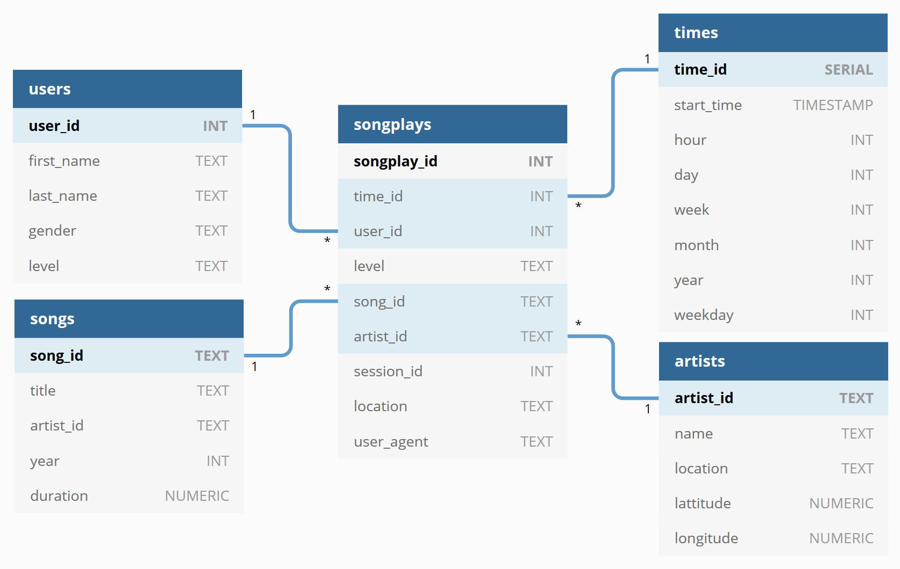

- [About this repo](#About-this-repo) 
- [Purpose of this database](#Purpose-of-this-database)
- [The ETL process](#The-ETL-process)
- [The schema](#The-schema)
- [How To run](#How-To-run)
- [Files in this repository](#Files-in-this-repository)
- [References](#References)

# About this repo
> This notebook is the first project of [Data Engineering Nanodegree (DEND)](https://www.udacity.com/course/data-engineer-nanodegree--nd027) from Udacity<br>
> Udacity provide a Jupyter environment with Postgres DB ready to use.<br>
> If you are a Udacity student, please keep in mind [Udacity Honor Code and Community Guidelines](https://www.udacity.com/legal/en-eu/community-guidelines)<br>
> The project description is as follows
### Introduction
A startup called Sparkify wants to analyze the data they've been collecting on songs and user activity on their new music streaming app. The analytics team is particularly interested in understanding what songs users are listening to. Currently, they don't have an easy way to query their data, which resides in a directory of JSON logs on user activity on the app, as well as a directory with JSON metadata on the songs in their app.

They'd like a data engineer to create a Postgres database with tables designed to optimize queries on song play analysis, and bring you on the project. Your role is to create a database schema and ETL pipeline for this analysis. You'll be able to test your database and ETL pipeline by running queries given to you by the analytics team from Sparkify and compare your results with their expected results.
### Project Description
In this project, you'll apply what you've learned on data modeling with Postgres and build an ETL pipeline using Python. To complete the project, you will need to define fact and dimension tables for a star schema for a particular analytic focus, and write an ETL pipeline that transfers data from files in two local directories into these tables in Postgres using Python and SQL.

# Purpose of this database

Sparkify want to analyze how their new (web)app is used. For that, they mainly dispose of a web server log.<br>
This log expose among other the *next_song* action which can help to determine : <br>
- from where, when and with which web browser the app is used
- the peak hours, how many people are using
- user songs choice what do he like

This can help improve the service provided and maybe lead to a suggestions system<br>
On other hand, they export their songs database who can help making a match between user and artist location and maybe respond to the question "do our customer buy locally ?".<br>
> The exposed songs data in this lab is very limited. I have had to insert manually data in order to test the query for songs & artist ID in "Getting artists & song ID" in `ETL.ipynb`

# The ETL process

> A lot of my thought/reflexion are in etl.ipynb (so go there please ;-)<br>

The files are directly extracted to Pandas dataframes for transformation.<br>
For loading the data into PostgreSQL, I choosed the `COPY` style option.<br>
That implicate no INSERT queries and the whole transform process has to be done in Python with Pandas.<br>
_So I can not use the `ON CONFLICT` statement as I dont use any direct `INSERT` queries (or UPSERT) for the loading phase_<br>

The key point about transformation is to prepare to datas to direct input. Dataframe have to be CSV compliant
So I have had to take care of : 
- remove tab character because of its usage in CSV file, 
- uniformise empty, NULL or NaN (Not a Number) "values" in order to make copy_from() directly
- datatype cannot be mixed for the same column, specialy for primary keys (for example `int` & `str` in users dataset)
- ensure that there are no duplicates

I mainly used Pandas dataframe to do those jobs and also to better choose datatype in PostgreSQL<br>
The presence of infos depend of the source of the dataset : ther are less infos in human created files then in computer generated files.<br>

# The schema
The goals mentioned above imply logically songplays as the fact table<br>
The tables extracted from the same dataset are potentially in a 1:1 relation :
- users, times & songplays from log json files
- songs & artists from songs json files

Some point had to be mentionned here :<br>
- Implementation of table constraints have an impact on the sequence of creation & deletion.
- The suggested primary key for times table (timestamp) isn't reliable.<br> 
This is generally the case when a key means something (here the timestamp)<br>
Because an event in the log can without doubt occurs at the same time.<br>
The solution was to implement a SERIAL PK field in times table and use it has a foreign key in somgplays table<br>
(see "Why do we need another primary key ?" in etl.ipynb). 
- the COPY method lead me understand a type mixing in user_id field<br>
So there is a potential bug in the log function of the web app !<br>
(see "Manage duplicates caused by type and keep the last level (or status)" in etl.ipynb)

Here you can find the schema :




Direct link to [Sparkify ERD diagram created with dbdiagram.io](https://dbdiagram.io/d/5ccdf91bf7c5bb70c72fddbd)

# How To run
In a jupyter notebook cell use the following commands (test.ipynb)
``` ipython
%run create_tables.py #prepare the database schema
%run etl.py #launch the ETL pipline
```
# Files in this repository
> A TOC is generally implemented in each notebook

- dashboard.ipynb : trigger some queries & plot related graphs
- etl-tests.ipynb : used to faciliatte the developpment of etl.py
- etl.ipynb : this file contains all the brainstorming and the analysis on data
- test.ipynb : used to quickly query the db. Contains tools to mange buggy db connections
- create_tables.py : Manage creation of the db and tables
- etl.py : ETL pipeline
- README.md : this file
- sql_queries.py : list of DSN & SQL queries to create, drop, insert & select

# References
[Million SOngs Dataset](https://labrosa.ee.columbia.edu/millionsong/pages/field-list)